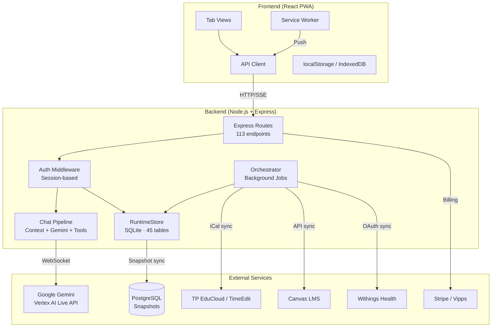
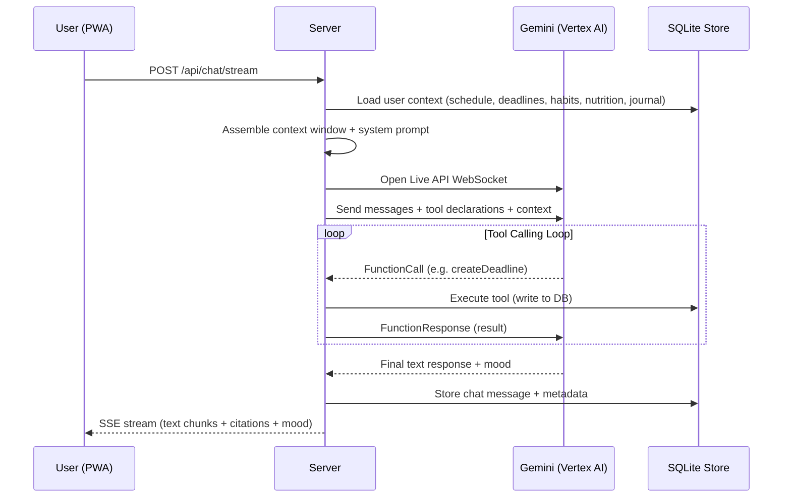
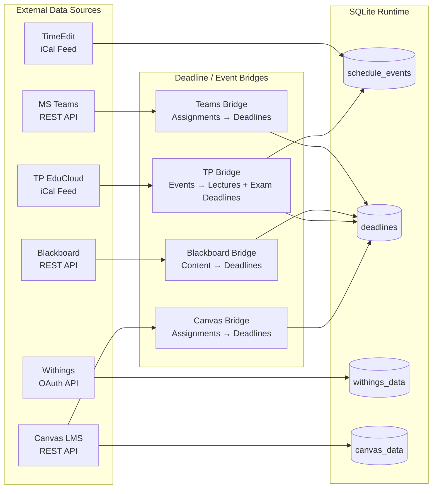
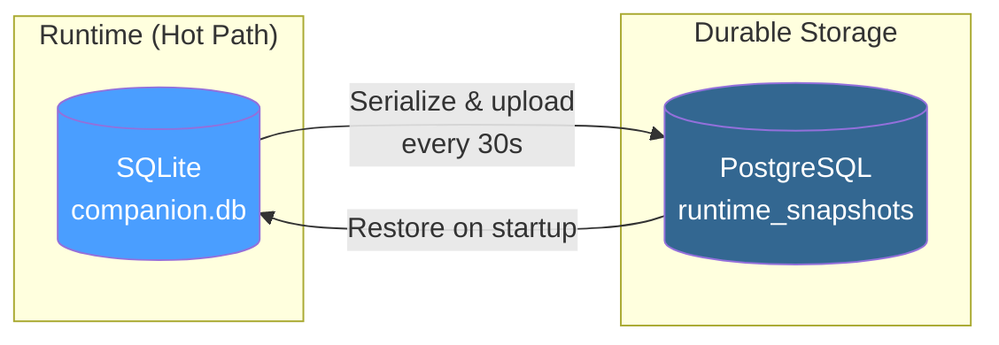
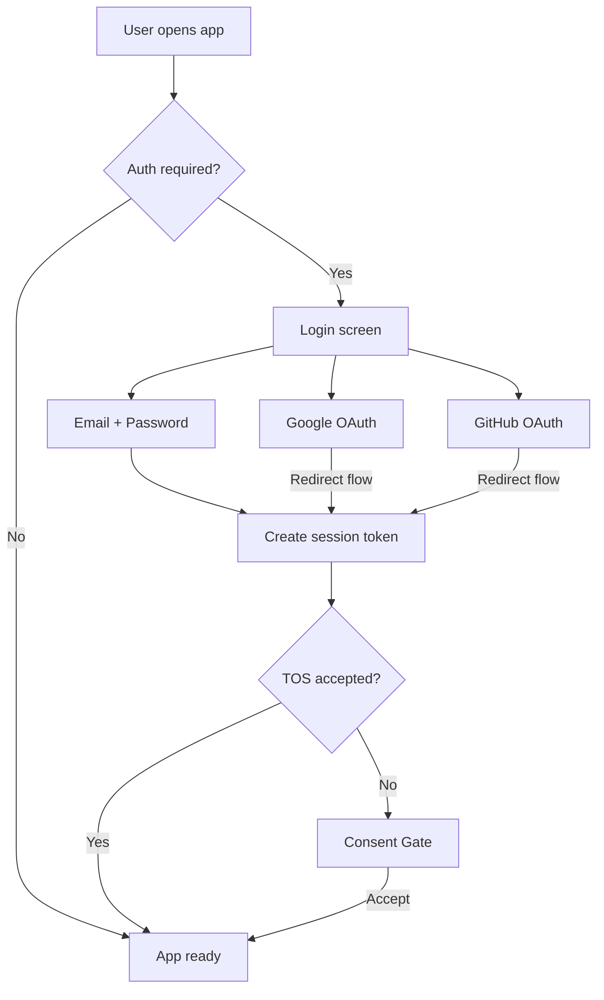
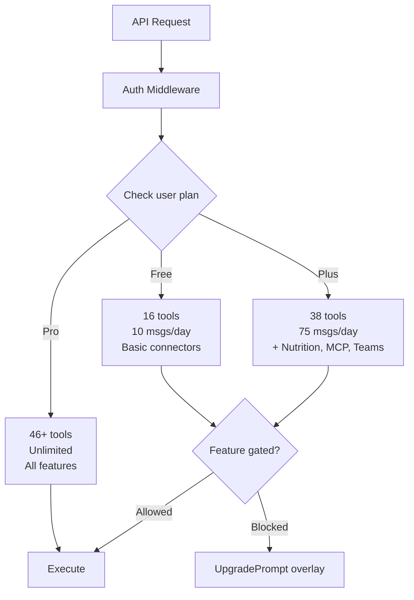
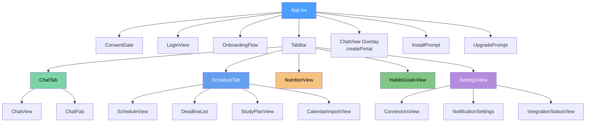
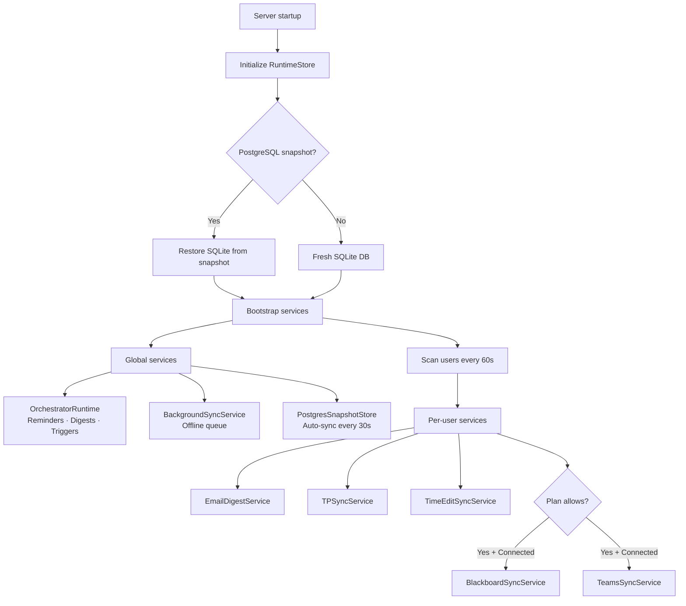

# Architecture Diagrams

Visual reference for Companion's system architecture using Mermaid diagrams.

---

## High-Level Architecture

---

## Chat Request Flow

---

## Data Flow: Integrations

---

## Database Persistence

---

## Authentication Flow

---

## Plan Tier Gating

---

## Frontend Component Tree

---

## Background Service Lifecycle

